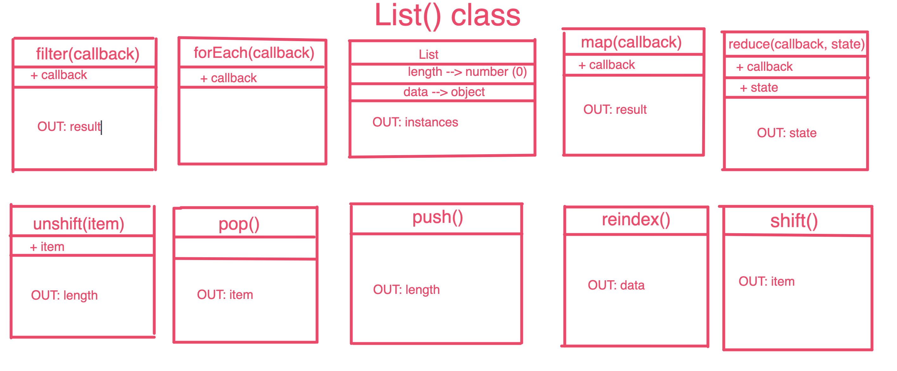

# LAB - 02

## Classes, Inheritance, Functional Programming

### Author: James Dunn

### Links and Resources
* [submission PR](https://github.com/james-401-advanced-javascript/lab-02/pull/1)
* [travis](https://travis-ci.com/james-401-advanced-javascript/lab-02)
* [front-end](https://jamesdunn-lab-02.herokuapp.com)

#### Documentation
* [jsdoc](https://jamesdunn-lab-02.herokuapp.com/docs)

### Modules
#### `validator.js`
#### `vehicles.js`
#### `list.js`

##### Exported Values and Methods
###### `Vehicle`
###### `List`
###### `Validator`

### Setup
#### `.env` requirements
* `PORT` - 3000

#### Running the app
* `npm start`
* Endpoint: `index.js`
  * Returns an express server.
  
#### Tests
* How do you run tests?
* `npm test`

#### UML
